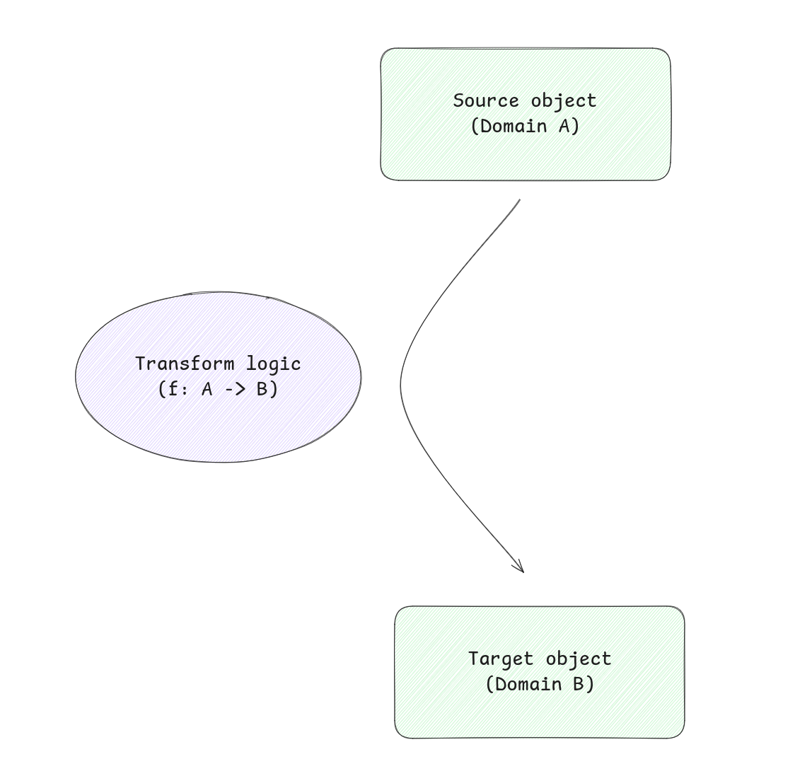
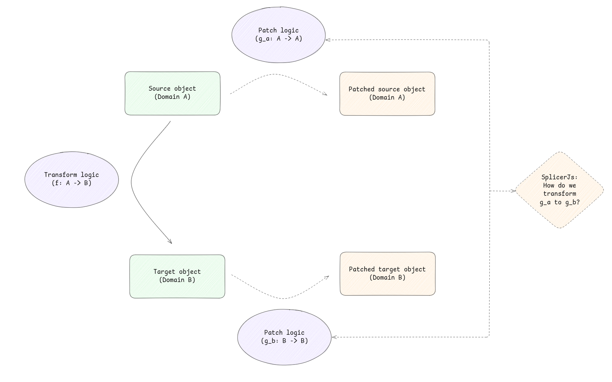

# Splicer.js


Reactive computation via finite differencing.

# Problem

Given a source domain $A$, a target domain $B$, and a pure function $f: A \to B$, we maintain two variables $x \in A$ and $y \in B$ such that $y = f(x)$ always holds (in all observable states).



The question: can we update $y$ automatically and efficiently when $x$ changes, without recomputing $f(x)$ from scratch every time? More precisely, if we write to $x$ then read $y$ without any other writes to $x$ in between, $y$ should always be $f(x)$!

splicer.js aims to resolve this problem via **finite differencing**: given $f$ and a delta $\Delta x$ on the input, we derive a delta propagator $\Delta f$ such that $f(x + \Delta x) = f(x) + \Delta f(x, \Delta x)$, updating $y$ by applying $\Delta f$ directly - without rerunning $f$ from scratch.



# Backstory

I'm working on frontend logic that transforms objects from domain A into objects of domain B. Recomputing the full transformation every time A changes is wasteful. Vue's `computed` doesn't fully solve this - it rebuilds the derived value from scratch on every change. When A changes frequently, B gets rebuilt just as often.

What I actually wanted was delta propagation, not just reactivity.

# Incremental Computation vs Delta Propagation vs Reactivity

The line between these is blurry. My current understanding (which may be inaccurate):

| | Reactivity | Incremental computation | Delta propagation |
|---|---|---|---|
| Core idea | Derived outputs update automatically when inputs change | Update efficiently via partial recomputation, not full recomputation | Derive $\Delta f$ that maps input deltas directly to output deltas |
| Mechanism | Dependency graph separating base states from derived states | Dependency graph that selectively re-executes stale nodes | Transform the logic itself - no graph, no re-execution |
| Granularity | Whole derived value rebuilds on change | Node-level - entire nodes re-evaluate, just fewer of them | Surgical - individual mutations on the output |
| Automation | Automatic | Automatic | Manual (must define $\Delta f$ for each $f$) |
| Examples | Vue `ref`/`computed` | Adapton, self-adjusting computation | splicer.js |

splicer.js sits in the delta propagation camp. It doesn't propagate values through a graph - it propagates deltas through transformed patch logic, mutating outputs directly. The tradeoff of delta propagation is the manual derivation of $\Delta f$ - splicer.js aims to make this transformation logic as automatic as possible.

Incrementality and reactivity are [two sides of the same coin](https://interjectedfuture.com/lab-note-049-survey-of-reactive-and-incremental-programming/):

- Reactivity is the "what": derived outputs update automatically when inputs change. A programming model that separates base states (Vue's `ref`) from derived states (Vue's `computed`), with automatic change propagation through a dependency graph.
- Incremental computation is the "how": updating efficiently via partial recomputation rather than full recomputation. Without it, reactivity becomes too expensive at scale.

splicer.js is incremental, but not in the general sense. General incremental computation (Adapton, self-adjusting computation) builds a dependency graph at runtime, traces which subcomputations read which inputs, and selectively re-executes stale nodes when inputs change. The granularity of update is the subcomputation - entire nodes re-evaluate, just fewer of them.

Delta propagation via finite differencing takes a different approach entirely. Instead of tracking dependencies and selectively re-executing nodes, we transform the logic itself: given a function $f$, we derive a delta propagator $\Delta f$ that maps an input delta $\Delta x$ directly to an output delta $\Delta y$, then mutate the output in place. There is no computation graph, no dependency tracking, no re-execution of $f$. The update path is a separate, hand-derived (or mechanically derived) piece of code that knows how to patch the output given a description of what changed in the input.

<details>
<summary>Subtleties</summary>

- Vue is already incremental at the graph level - only dependent `computed` nodes re-evaluate, not all of them. But within each node, the derived value rebuilds entirely from scratch. Delta propagation eliminates this: deltas propagate through the transformation, not around it.
- If every node in an incremental computation graph is a lazy, cached function call that looks and feels like a variable, then an incremental system becomes indistinguishable from a reactive one:

  ```mermaid
  graph LR
    subgraph "Reactive system"
      A1[ref A] --> C1["computed B = f(A)"]
      C1 --> C2["computed C = g(B)"]
    end

    subgraph "Incremental system"
      A2[input A] --> F1["B = f(A) - lazy, cached"]
      F1 --> F2["C = g(B) - lazy, cached"]
    end

    style A1 fill:#4a9,stroke:#333,color:#fff
    style A2 fill:#4a9,stroke:#333,color:#fff
    style C1 fill:#49a,stroke:#333,color:#fff
    style C2 fill:#49a,stroke:#333,color:#fff
    style F1 fill:#49a,stroke:#333,color:#fff
    style F2 fill:#49a,stroke:#333,color:#fff
  ```

  Both graphs have the same shape: inputs flow into derived nodes. The difference is only in the implementation - "computed" values vs lazy cached calls. When access is transparent (reading `B` feels like reading a variable), the two are equivalent from the consumer's perspective.

</details>
