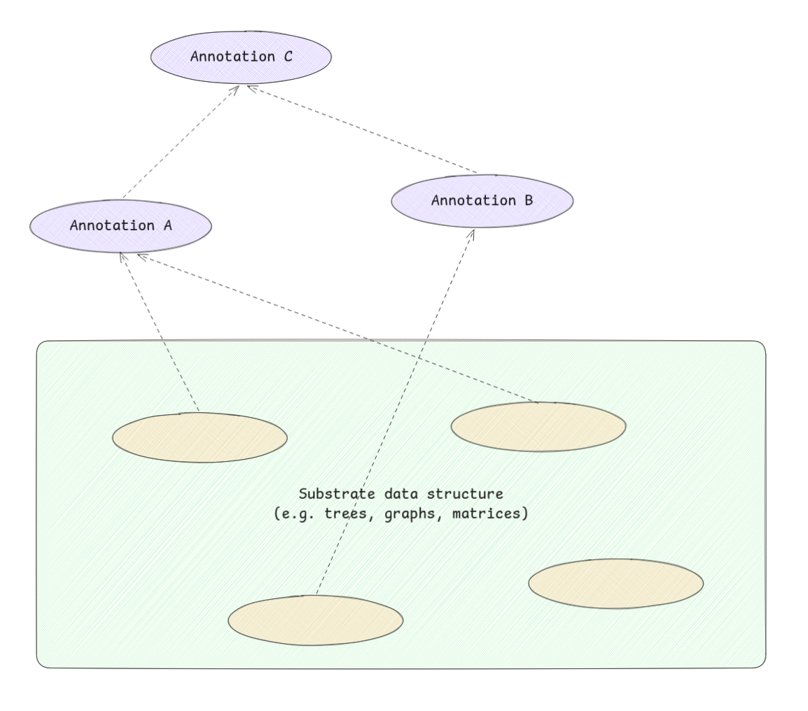

# A Categorized Bibliography on Incremental Computation

Ramalingam & Reps, 1993. [ACM Digital Library](https://dl.acm.org/doi/10.1145/158511.158710).

See [research material](../../research/surveys.md).

Important keywords:
- Incremental computation.
- Batch computation.
- Dynamization of static problems.
- Selective recomputation.
- Finite differencing.

## Abstract

Small changes in the input to a computation often cause only small changes in the output. Rather than recomputing from scratch, we should be able to propagate only the delta. But until recently, I haven't known of a technique to do this efficently? Specifically, how do we transform a delta on the input to a delta on the output? How do we measure performance supposing we're taking this approach? The area of incremental computation was pretty much new to me, so I decided to read this survey to first have an overview of the field first.

This survey formalizes the problem raised above as follows: given \\(f\\) and input \\(x\\), keep \\(f(x)\\) up to date as \\(x\\) changes. An incremental algorithm takes batch input \\(x\\), batch output \\(f(x)\\), a change \\(\Delta x\\), and auxiliary information maintained across updates, and produces \\(f(x + \Delta x)\\).

The idea turns out to be everywhere. Similar notions of incremental computation arose in many fields but before this survey, little effort has been spent to unify these notions. This survey was intended to not only focus on the techniques within the programming language community, but also take a look in other areas as well.

The PL community cares about it for:

- Reactive language primitives (observables, signals, etc)
- Compiler optimization, especially in loops, in which changes between iterations can be small.
- Responsive dev tools, such as IDE-centric program analyzers/compilers should not re-do it from scratch every time the user edits a file.

However, there is a less well-known body of related work in algorithms:

- Dynamic graph problems
- Dynamization of static structures
- Databases (view maintenance)
- AI (truth maintenance)
- VLSI (incremental design-rule checking)

All working on variants of the same underlying problem.

## Introduction

Small updates in input usually cause small changes in output. Therefore, the intuition is that it's more efficient to compute the changes it takes to go from the previous output to the new output, rather than recompute the output from scratch.

The authors survey this idea across multiple fields, deliberately bridging between programming languages research and work in algorithms, AI, databases, and VLSI.

> _"Because small changes in the input to a computation often cause only small changes in the output, the challenge is to compute the new output incrementally by updating parts of the old output, rather than by recomputing the entire output from scratch."_

> _"The goal is to make use of the solution to one problem instance to find the solution to a 'nearby' problem instance."_

> _"In so doing, the goal was to expose ties between the ideas on incremental computation that developed out of research on programming languages and programming tools, and ideas that have been developed by researchers in other areas."_

The authors identify four areas where PL people care about incrementality:

1. **Reactive language primitives**: baking reactivity into languages (observables, signals, etc).
2. **Compiler optimization**: using incrementality as a compiler trick, e.g. loop optimization where changes between iterations are small.
3. **Responsive dev tools**: incremental parsing, type-checking, etc. This is what modern LSPs and IDEs do. Don't re-analyze the whole file on every keystroke.
4. **Compilers and tooling**: the practical realization of the first three.

But the survey also points to a less well-known body of work outside PL that I think is just as important:

1. **Comparison criteria**: how do you even measure whether an incremental algorithm is "good"? Standard batch complexity doesn't cut it.
2. **General principles**: things like dynamization of static problems. I think of this as foundational formulation/modeling.
3. **Problem-specific results**: results on individual incremental problems that might reveal new general principles.

## Assessment of Incremental Algorithms

### Computational Complexity

This is the "how do you measure it" section. Standard asymptotic analysis (big-O on total input size) doesn't work well for incremental problems. Under those criteria, an incremental algorithm and a full recomputation can look the same, or worse, the batch start-over can be deemed "optimal" for some incremental problems. That feels wrong.

The survey lays out several alternative criteria that make more sense:

- **Direct comparison**: just compare against the batch start-over algorithm directly.
- **Amortized-cost analysis**: average the cost over a worst-case sequence of operations. This is closer to how I'd intuitively think about incremental performance.
- **Competitiveness**: how much worse does an online algorithm (no future knowledge) do vs an optimal offline algorithm (perfect future knowledge), assuming an adversary picks the worst-case sequence? The competitive ratio is max cost(online) / cost(offline); lower is better, 1 is optimal. Interestingly, randomized online algorithms can beat the best deterministic ones, because the randomness limits what the adversary can exploit.
- **Probabilistic analysis**: average-case performance under random inputs, as opposed to worst-case.
- **Incremental relative lower bounds**: proving that for certain problems, no incremental algorithm can do better than batch start-over by more than some factor.
- **Reductions between problems**: showing one incremental problem is at least as hard as another, transferring bounds across problems.
- **Boundedness**: this one is interesting. Instead of cost as a function of total input size, measure cost as a function of \\(|\Delta x| + |\Delta f(x)|\\). An incremental algorithm is "bounded" if its update time depends only on the size of the change, never on the size of the full input. I think this is the most natural way to think about incrementality: ideally, if the change is small, the work should be small, regardless of how big the whole thing is.

### Measurements of Actual Performance

Few experimental evaluations of incremental algorithms exist. But the ones that do suggest something surprising: theoretically "bad" incremental algorithms can still perform well in practice. Real workloads may not hit worst cases. So the theoretical criteria above don't tell the whole story.

## Data-Structure Update Problems

### Incremental Annotations on Graphs/Trees

This section covers a specific class of problem that I think is very relevant to what I'm building. The setup is:

1. You have a "substrate" data structure \\(x\\), a tree, graph, matrix, whatever. This is the thing that changes.
2. \\(f(x)\\) maps the substrate's state to some "annotation" on it. Think of annotating an AST with type information or symbol resolution.
3. The problem: keep those annotations up to date as the substrate changes.

Annotations can depend on other annotations too, so changes can cascade.

The survey identifies three approaches:

- **Selective recomputation**: figure out which annotations are affected by a substrate change, then recompute only those.
  - A recomputed annotation if not changes may not need to trigger recomputation of further dependent annotations.
  - This is the approach behind:
    - Incremental updating of attributed derivation trees/augmented ASTs.
    - Incremental circuit-annotation problem.
    - Incremental data-flow analysis.
    - Path problems (e.g. shortest paths) in graphs.
  - At Holistics, the AML compiler mirrors salsa, presumably using this pattern also.
- **Differential updating**: instead of recomputing affected annotations from scratch, compute the _difference_ to apply. Related to database view maintenance and the INC language.
- **Other incremental expression-evaluation algorithms**:
  - Function caching.
  - Incremental reduction in the lambda calculus.
  - Dynamic expression trees.

### Other Dynamic Graph Problems

Maintaining:

- Graph properties (connectivity, transitive closure
- Minimum spanning trees.
- Planarity.

under edge insertions and deletions.

I'm not entirely sure whether "edge" here always means the lines between nodes or sometimes refers to leaf nodes?

The work covers a wide range, from Even & Shiloach's early edge-deletion problem (1981) through to Eppstein et al's sparsification technique (1992).

### Dynamization of Static Data Structures

This is a general methodology for transforming a static data structure into a dynamic one.

What does "static" mean here exactly? I think it means a structure that's built from scratch given the inputs, no support for incremental updates baked in.

### Finite Differencing

Finite differencing is about automatically deriving incremental maintenance logic from batch definitions. You write the batch computation, and the technique derives how to update the output when the input changes. **This is exactly what splicer.js is looking for.**

The foundational paper is Paige & Koenig (1982) on finite differencing of computable expressions. Earlier work by Earley on high-level iterators and by Fong & Ullman on induction variables laid the groundwork.

## Incremental Formal Systems

This section covers incrementalizing formal operations: reduction, parsing, deduction, constraint solving. I think of these as generic-but-also-specific techniques, each one applies a general incremental idea to a particular formal system.

- **Incremental reduction**: goes back to Lombardi & Raphael's early work on Lisp as a language for incremental computation (1964). More recent work includes partial evaluation (Sundaresh & Hudak) and incremental reduction in the lambda calculus (Field & Teitelbaum).
- **Incremental parsing**: how do you re-parse a file when only a small part changed? Work here includes augmenting parsers for incrementality (Ghezzi & Mandrioli), building "friendly" parsers (Jalili & Gallier), and even incremental parsing without a parser (Kaiser & Kant).
- **Truth maintenance**: from AI, starting with Doyle's foundational truth maintenance system (1979). The problem: when your assumptions change, how do you maintain consistency of all derived beliefs? de Kleer extended this with assumption-based TMS.
- **Incremental deduction**: rule support in Prolog, unification in many-sorted algebras, deriving incremental implementations from algebraic specifications.
- **Incremental constraint solving**: constraint satisfaction for graphical interfaces (Vander Zanden), incremental constraint solvers (Freeman-Benson et al).

## Applications, Frameworks, and Related Problems

The remaining sections cover more applied work. These feel less central to what I'm after, but worth noting:

- **Special-purpose algorithms**: domain-specific applications, including incremental compilation (DICE, Magpie), smart recompilation (Tichy), interactive document composition (JANUS), VLSI layout (Magic). These adapt incremental ideas to fairly niche fields.

- **Implementation frameworks**: actual systems that enable incremental computation. VisiCalc (the original spreadsheet!) is listed here, along with the Synthesizer Generator, CENTAUR, PSG, Pan, and Alphonse. Also includes Cai & Paige's SETL-family work on binding performance at language design time.

- **Related problems**: problems with similar structure, such as sensitivity analysis in linear network optimization, parametric maximum flow, continuous execution (Visiprog).

## Verdict

This survey draws bridges between PL and other fields that all use incremental ideas without necessarily talking to each other. It's from 1993, so it misses the modern reactive/FRP wave, but the foundations are all here. The section on finite differencing is the most relevant to splicer.js.

## References

### Assessment of Incremental Algorithms

| Authors                  | Year    | Title                                                                                   | Venue                             |
| ------------------------ | ------- | --------------------------------------------------------------------------------------- | --------------------------------- |
| Yellin, Strom            | 1991    | INC: A language for incremental computations                                            | ACM TOPLAS                        |
| Sleator, Tarjan          | 1983    | A data structure for dynamic trees                                                      | J Computer and System Sciences    |
| Tarjan                   | 1985    | Amortized computational complexity                                                      | SIAM J Algebraic Discrete Methods |
| Sleator, Tarjan          | 1985    | Amortized efficiency of list update and paging rules                                    | CACM                              |
| McGeoch, Sleator (eds)   | 1992    | On-Line Algorithms                                                                      | AMS                               |
| Karp                     | 1992    | On-line algorithms versus off-line algorithms: How much is it worth to know the future? | IFIP                              |
| Lomchard et al           | 1992    | Dynamic algorithms in D E Knuth's model: A probabilistic analysis                       | TCS                               |
| Berman, Paull, Ryder     | 1990    | Proving relative lower bounds for incremental algorithms                                | Acta Informatica                  |
| Reif                     | 1987    | A topological approach to dynamic graph connectivity                                    | IPL                               |
| Reps, Teitelbaum, Demers | 1983    | Incremental context-dependent analysis for language-based editors                       | ACM TOPLAS                        |
| Alpern et al             | 1990    | Incremental evaluation of computational circuits                                        | ACM-SIAM SODA                     |
| Ramalingam, Reps         | 1991-92 | On the computational complexity of incremental algorithms                               | UW-Madison TR                     |
| Dionne                   | 1978    | Etude et extension d'un algorithme de Marche                                            | INFOR                             |
| Taylor, Ousterhout       | 1984    | Magic's incremental design-rule checker                                                 | DAC                               |
| Scott, Ousterhout        | 1984    | Plowing: Interactive stretching and compaction in Magic                                 | DAC                               |
| Ryder, Landi, Pande      | 1990    | Profiling an incremental data flow analysis algorithm                                   | IEEE Trans. Software Eng.         |
| Harrison, Munson         | 1991    | Numbering document components                                                           | Electronic Publishing             |

### Selective Recomputation

| Authors                                  | Year    | Title                                                                                     | Venue                                    |
| ---------------------------------------- | ------- | ----------------------------------------------------------------------------------------- | ---------------------------------------- |
| Demers, Reps, Teitelbaum                 | 1981    | Incremental evaluation for attribute grammars with application to syntax-directed editors | POPL                                     |
| Reps                                     | 1982    | Optimal-time incremental semantic analysis for syntax-directed editors                    | POPL                                     |
| Reps, Teitelbaum, Demers                 | 1983    | Incremental context-dependent analysis for language-based editors                         | ACM TOPLAS                               |
| Reps                                     | 1984    | Generating Language-Based Environments                                                    | MIT Press                                |
| Yeh                                      | 1983    | On incremental evaluation of ordered attributed grammars                                  | BIT                                      |
| Jones, Simon                             | 1986    | Hierarchical VLSI design systems based on attribute grammars                              | POPL                                     |
| Reps, Marceau, Teitelbaum                | 1986    | Remote attribute updating for language-based editors                                      | POPL                                     |
| Hoover, Teitelbaum                       | 1986    | Efficient incremental evaluation of aggregate values in attribute grammars                | SIGPLAN Compiler Construction            |
| Hoover                                   | 1987    | Incremental graph evaluation                                                              | Cornell PhD                              |
| Kaiser                                   | 1989    | Incremental dynamic semantics for language-based programming environments                 | ACM TOPLAS                               |
| Teitelbaum, Chapman                      | 1990    | Higher-order attribute grammars and editing environments                                  | PLDI                                     |
| Zaring                                   | 1990    | Parallel evaluation in attribute grammar based systems                                    | Cornell PhD                              |
| Alpern et al                             | 1990    | Incremental evaluation of computational circuits                                          | ACM-SIAM SODA                            |
| Ramalingam, Reps                         | 1991-92 | On the computational complexity of incremental algorithms                                 | UW-Madison TR                            |
| Rosen                                    | 1981    | Linear cost is sometimes quadratic                                                        | POPL                                     |
| Ryder                                    | 1982    | Incremental data flow analysis based on a unified model of elimination algorithms         | Rutgers PhD                              |
| Zadeck                                   | 1983-84 | Incremental data flow analysis in a structured program editor                             | Rice PhD / SIGPLAN Compiler Construction |
| Cooper, Kennedy                          | 1986    | The impact of interprocedural analysis and optimization in the Rn programming environment | ACM TOPLAS                               |
| Burke; Burke, Ryder                      | 1987    | Interval-based and iterative incremental data-flow analysis                               | IBM TR                                   |
| Carroll, Ryder                           | 1988    | Incremental data flow update via attribute and dominator updates                          | POPL                                     |
| Ryder, Paull                             | 1988    | Incremental data flow analysis algorithms                                                 | ACM TOPLAS                               |
| Marlowe; Marlowe, Ryder                  | 1989-90 | Efficient hybrid algorithm for incremental data flow analysis                             | Rutgers PhD / POPL                       |
| Murchland 1967 ... Ramalingam, Reps 1992 | 1967-92 | Maintaining shortest distances in graphs                                                  | Various                                  |

### Differential Updating

| Authors                      | Year    | Title                                                                  | Venue                    |
| ---------------------------- | ------- | ---------------------------------------------------------------------- | ------------------------ |
| Koenig, Paige                | 1981    | A transformational framework for the automatic control of derived data | VLDB                     |
| Shmueli, Itai                | 1984    | Maintenance of views                                                   | ACM SIGMOD               |
| Horwitz; Horwitz, Teitelbaum | 1985-86 | Generating editing environments based on relations and attributes      | Cornell PhD / ACM TOPLAS |
| Yellin, Strom                | 1991    | INC: A language for incremental computations                           | ACM TOPLAS               |

### Other Incremental Expression-Evaluation

| Authors                  | Year    | Title                                           | Venue                     |
| ------------------------ | ------- | ----------------------------------------------- | ------------------------- |
| Pugh; Pugh, Teitelbaum   | 1988-89 | Incremental computation via function caching    | Cornell PhD / POPL        |
| Field, Teitelbaum; Field | 1990-91 | Incremental reduction in the lambda calculus    | ACM Lisp/FP / Cornell PhD |
| Cohen, Tamassia          | 1991    | Dynamic expression trees and their applications | ACM-SIAM SODA             |

### Dynamic Graph Problems

| Authors                                | Year | Title                                                                                    | Venue            |
| -------------------------------------- | ---- | ---------------------------------------------------------------------------------------- | ---------------- |
| Cheston                                | 1976 | Incremental algorithms in graph theory                                                   | U Toronto PhD    |
| Even, Shiloach                         | 1981 | An on-line edge-deletion problem                                                         | J ACM            |
| Frederickson                           | 1985 | Data structures for on-line updating of minimum spanning trees                           | SIAM J Computing |
| Italiano                               | 1986 | Amortized efficiency of a path retrieval data structure                                  | TCS              |
| Reif                                   | 1987 | A topological approach to dynamic graph connectivity                                     | IPL              |
| La Poutre, van Leeuwen                 | 1988 | Maintenance of transitive closures and transitive reductions of graphs                   | WG               |
| Italiano                               | 1988 | Finding paths and deleting edges in directed acyclic graphs                              | IPL              |
| Yellin                                 | 1988 | A dynamic transitive closure algorithm                                                   | IBM TR           |
| Di Battista, Tamassia                  | 1989 | Incremental planarity testing                                                            | FOCS             |
| Buchsbaum, Kanellakis, Vitter          | 1990 | A data structure for arc insertion and regular path finding                              | ACM-SIAM SODA    |
| Yannakakis                             | 1990 | Graph-theoretic methods in database theory                                               | PODS             |
| Frederickson                           | 1991 | Ambivalent data structures for dynamic 2-edge-connectivity and k smallest spanning trees | FOCS             |
| Galil, Italiano                        | 1991 | Fully dynamic algorithms for edge-connectivity problems                                  | STOC             |
| Kanevsky et al                         | 1991 | On-line maintenance of the four-connected components of a graph                          | FOCS             |
| La Poutre                              | 1992 | Maintenance of triconnected components of graphs                                         | ICALP            |
| Eppstein, Galil, Italiano, Nissenzweig | 1992 | Sparsification: A technique for speeding up dynamic graph algorithms                     | FOCS             |

### Dynamization of Static Data Structures

| Authors                                | Year | Title                                                                                    | Venue         |
| -------------------------------------- | ---- | ---------------------------------------------------------------------------------------- | ------------- |
| Bentley                                | 1979 | Decomposable searching problems                                                          | IPL           |
| Bentley, Saxe                          | 1980 | Decomposable searching problems I: Static-to-dynamic transformations                     | J Algorithms  |
| Overmars                               | 1983 | The Design of Dynamic Data Structures                                                    | Springer LNCS |
| Mehlhorn                               | 1984 | Data Structures and Algorithms 3: Multi-Dimensional Searching and Computational Geometry | Springer      |
| Eppstein, Galil, Italiano, Nissenzweig | 1992 | Sparsification: A technique for speeding up dynamic graph algorithms                     | FOCS          |

### Finite Differencing

| Authors            | Year    | Title                                                                                            | Venue                              |
| ------------------ | ------- | ------------------------------------------------------------------------------------------------ | ---------------------------------- |
| Earley             | 1974-76 | High-level operations in automatic programming / High-level iterators                            | SIGPLAN VHL / J Computer Languages |
| Fong, Ullman; Fong | 1976-79 | Induction variables / Common subexpressions / Inductively computable constructs in VHL languages | POPL                               |
| Paige, Koenig      | 1982    | Finite differencing of computable expressions                                                    | ACM TOPLAS                         |
| Goldberg, Paige    | 1984    | Stream processing                                                                                | ACM Lisp/FP                        |
| Paige              | 1986    | Programming with invariants                                                                      | IEEE Software                      |

### Incremental Formal Systems

| Authors                          | Year    | Title                                                                           | Venue                             |
| -------------------------------- | ------- | ------------------------------------------------------------------------------- | --------------------------------- |
| Lombardi, Raphael; Lombardi      | 1964-67 | Lisp as the language for an incremental computer / Incremental computation      | MIT Press / Advances in Computers |
| Sundaresh, Hudak; Sundaresh      | 1991    | Incremental computation via partial evaluation                                  | POPL / Yale PhD                   |
| Field, Teitelbaum; Field         | 1990-91 | Incremental reduction in the lambda calculus                                    | ACM Lisp/FP / Cornell PhD         |
| MacLennan                        | 1986-87 | A calculus of functional differences and integrals                              | Naval Postgraduate School TR      |
| Ghezzi, Mandrioli                | 1979-80 | Incremental parsing / Augmenting parsers to support incrementality              | ACM TOPLAS / J ACM                |
| Wegman                           | 1980    | Parsing for structural editors                                                  | FOCS                              |
| Jalili, Gallier                  | 1982    | Building friendly parsers                                                       | POPL                              |
| Kaiser, Kant                     | 1985    | Incremental parsing without a parser                                            | J Systems and Software            |
| Doyle                            | 1979    | A truth maintenance system                                                      | Artificial Intelligence           |
| de Kleer                         | 1986    | An assumption-based TMS / Extending the ATMS / Problem solving with the ATMS    | Artificial Intelligence           |
| McAllister                       | 1990    | Truth maintenance                                                               | AAAI                              |
| Shmueli, Tsur, Zfira             | 1984    | Rule support in Prolog                                                          |                                   |
| Mannila, Ukkonen                 | 1988    | Time parameter and arbitrary deletions in the set union problem                 | SWAT                              |
| Snelting, Henhapl                | 1986    | Unification in many-sorted algebras for incremental semantic analysis           | POPL                              |
| Ballance; Ballance, Graham       | 1989-91 | Syntactic/semantic checking and incremental consistency maintenance             | UC Berkeley PhD / ICLP            |
| van der Meulen                   | 1990    | Deriving incremental implementations from algebraic specifications              | CWI TR                            |
| Vander Zanden                    | 1988    | Incremental constraint satisfaction and its application to graphical interfaces | Cornell PhD                       |
| Freeman-Benson, Maloney, Borning | 1990    | An incremental constraint solver                                                | CACM                              |

### Special-Purpose Algorithms

| Authors                          | Year    | Title                                                                                                  | Venue                                 |
| -------------------------------- | ------- | ------------------------------------------------------------------------------------------------------ | ------------------------------------- |
| Fritzson                         | 1984    | Preliminary experience from the DICE system                                                            | ACM SIGPLAN/SIGSOFT                   |
| Schwartz, Delisle, Begwani       | 1984    | Incremental compilation in Magpie                                                                      | SIGPLAN Compiler Construction         |
| Tichy                            | 1986    | Smart recompilation                                                                                    | ACM TOPLAS                            |
| Schwanke, Kaiser                 | 1988    | Smarter recompilation                                                                                  | ACM TOPLAS                            |
| Cooper, Kennedy                  | 1986    | The impact of interprocedural analysis and optimization in the Rn programming environment              | ACM TOPLAS                            |
| Burke, Torczon                   |         | Interprocedural optimization: Eliminating unnecessary recompilation                                    | ACM TOPLAS                            |
| Chamberlain et al                | 1981-87 | JANUS: An interactive system for document composition / Document convergence                           | ACM SIGPLAN / IBM Systems J           |
| Chen, Harrison; Harrison, Munson | 1988-91 | Multiple representation document development / Integrated bibliography / Numbering document components | IEEE Computer / Electronic Publishing |
| Brooks                           | 1988    | A two-view document editor with user-definable document structure                                      | DEC Systems Research Center TR        |
| Ousterhout et al                 | 1984    | Magic: A VLSI layout system                                                                            | DAC                                   |
| Taylor, Ousterhout               | 1984    | Magic's incremental design-rule checker                                                                | DAC                                   |
| Scott, Ousterhout                | 1984    | Plowing: Interactive stretching and compaction in Magic                                                | DAC                                   |

### Implementation Frameworks

| Authors                         | Year    | Title                                                                                                                              | Venue                                          |
| ------------------------------- | ------- | ---------------------------------------------------------------------------------------------------------------------------------- | ---------------------------------------------- |
| Bricklin, Frankston             | 1979    | VisiCalc                                                                                                                           | Personal Software Inc                          |
| Alpern et al                    | 1989    | Graph attribution as a specification paradigm                                                                                      | ACM SIGPLAN/SIGSOFT                            |
| Borning                         | 1979    | ThingLab: A constraint-oriented simulation laboratory                                                                              | Stanford PhD / Xerox PARC                      |
| Konopasek, Jayaraman            | 1984    | The TK!Solver Book                                                                                                                 | Osborne/McGraw-Hill                            |
| Reps, Teitelbaum                | 1988    | The Synthesizer Generator                                                                                                          | Springer                                       |
| Borras et al                    | 1988    | CENTAUR: The system                                                                                                                | ACM SIGPLAN/SIGSOFT                            |
| Bahlke, Snelting                | 1986    | The PSG system: From formal language definitions to interactive programming environments                                           | ACM TOPLAS                                     |
| Ballance, Graham, Van De Vanter | 1992    | The Pan language-based editing system                                                                                              | ACM TOSEM                                      |
| Paige, Koenig                   | 1982    | Finite differencing of computable expressions                                                                                      | ACM TOPLAS                                     |
| Cai, Paige                      | 1987-91 | Binding performance at language design time / Program derivation by fixed point computation / Languages polynomial in input+output | POPL / Science of Computer Programming / AMAST |
| Hoover                          | 1992    | Alphonse: Incremental computation as a programming abstraction                                                                     | PLDI                                           |

### Related Problems

| Authors                    | Year | Title                                                     | Venue            |
| -------------------------- | ---- | --------------------------------------------------------- | ---------------- |
| Bertsekas                  | 1991 | Linear Network Optimization: Algorithms and Codes         | MIT Press        |
| Gallo, Grigoriadis, Tarjan | 1989 | A fast parametric maximum flow algorithm and applications | SIAM J Computing |
| Henderson, Weiser          | 1985 | Continuous execution: The Visiprog environment            | IEEE ICSE        |
